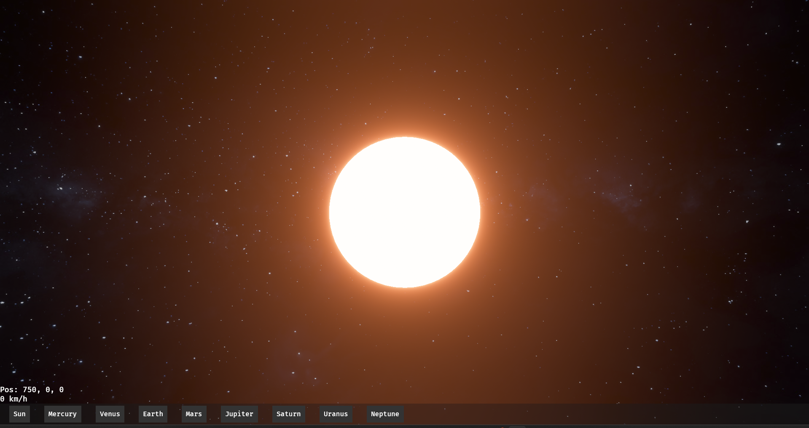
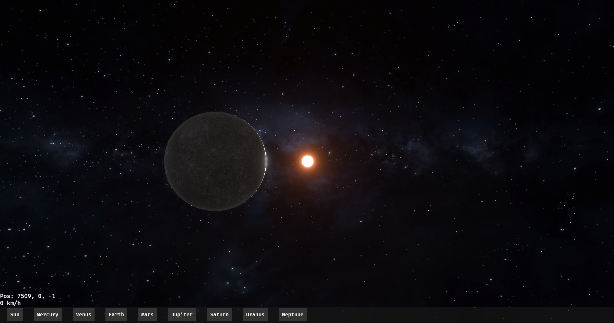
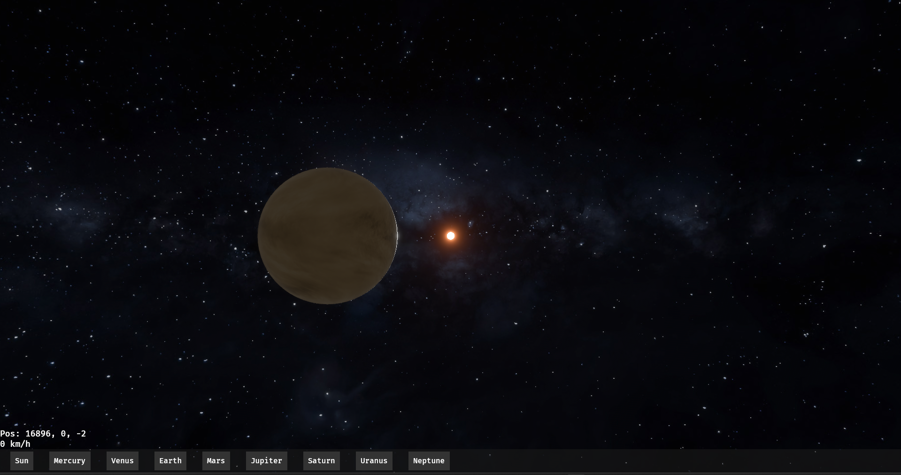
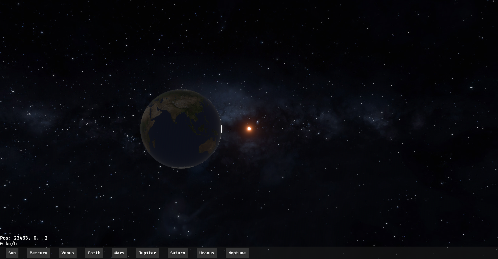
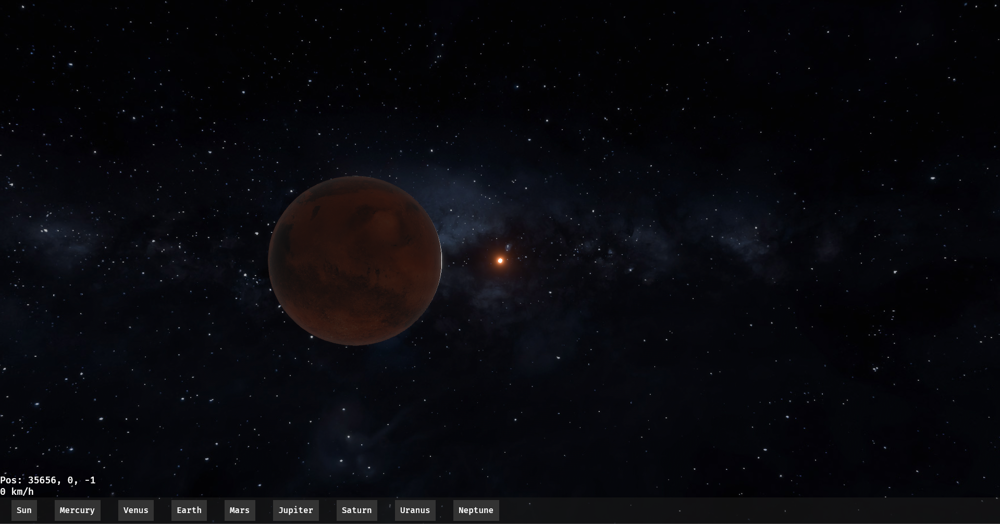
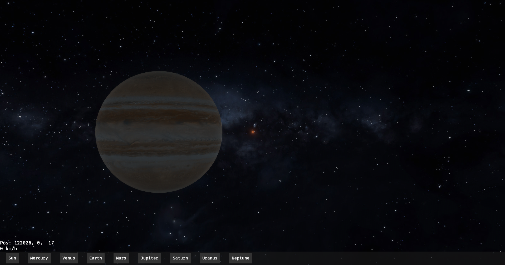
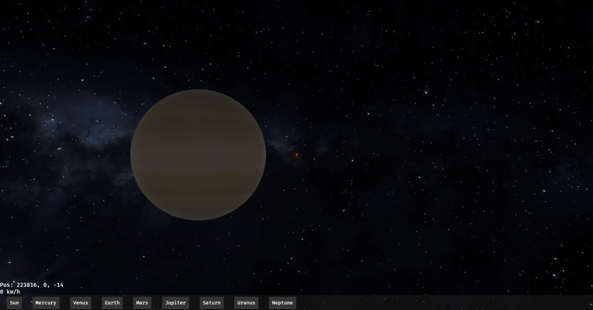
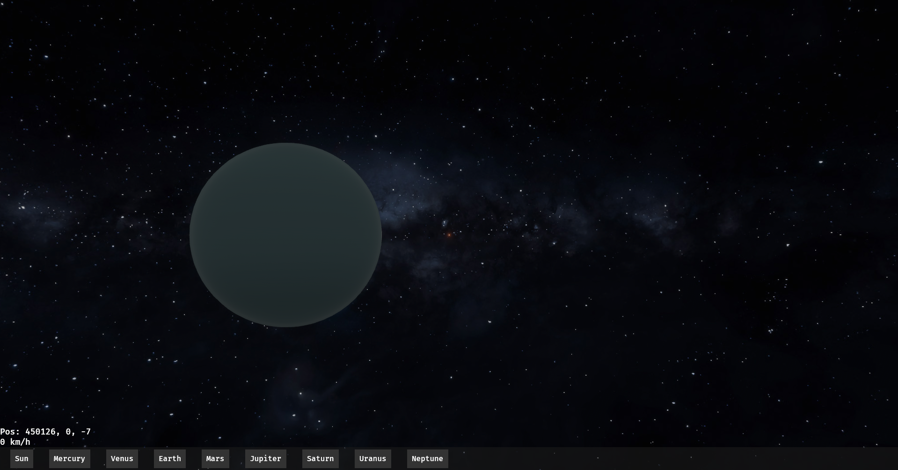
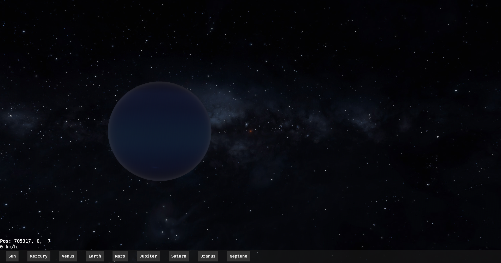

# Solar-System Simulator

## Usage
### Install & Start
```bash
> git clone https://github.com/hinokaito/solar-system-simulator.git
> cd solar-system-simulator
> cargo run --release
```

### Operation
- MOVE: `W/A/S/D`
- VIEW CONTROL: `Q/E`
- UP/DOWN: `Space/LCtrl`

### Screenshots
**SUN**


**MERCURY**


**VENUS**


**EARTH**


**MARS**


**JUPITER**


**SATURN**


**URANUS**


**NEPTUNE**


## Assets & Licenses
Some textures used in this project are provided by Solar System Scope.

- Source: Solar System Scope  
  https://www.solarsystemscope.com/textures/  
- License: CC BY 4.0  
  https://creativecommons.org/licenses/by/4.0/  
- Modifications: Textures may have been resized or otherwise modified for use in this project.